```mermaid
graph TB
    subgraph OnPrem["Sede Local / On-Premises (172.16.1.0/24)"]
        LocalSrv["Servidores Locales<br/>(Azure Arc Connected)"]
        LocalGW["VPN Gateway Local"]
    end

    subgraph AzureCloud["Microsoft Azure (westeurope)"]
        subgraph VNetHub["VNet Hub (10.0.0.0/16)"]
            VPNGW["VPN Gateway<br/>GatewaySubnet (10.0.2.0/27)"]
            FW["Azure Firewall<br/>AzureFirewallSubnet (10.0.1.0/26)"]
            Bastion["Azure Bastion<br/>AzureBastionSubnet (10.0.3.0/26)"]
            
            subgraph MgmtSubnet["snet-management (10.0.4.0/24)"]
                ILB["Internal Load Balancer<br/>10.0.4.9 (DNS:53, LDAP:389)"]
                DC1["DC-01 (Zone 1)<br/>10.0.4.10"]
                DC2["DC-02 (Zone 2)<br/>10.0.4.11"]
                ILB --> DC1
                ILB --> DC2
            end
        end

        subgraph VNetWoo["VNet Spoke WooCommerce (10.1.0.0/16)"]
            subgraph AKSSubnet["snet-aks-nodes (10.1.1.0/24)"]
                AKS["AKS Cluster<br/>(WooCommerce / WP)"]
            end
            subgraph DBSubnet["snet-database (10.1.10.0/24)"]
                MySQL["MySQL Flexible Server"]
            end
            subgraph CacheSubnet["snet-cache (10.1.11.0/24)"]
                Redis["Azure Cache for Redis"]
            end
            AKS --> MySQL
            AKS --> Redis
        end

        subgraph VNetCorp["VNet Spoke Corporate (10.2.0.0/16)"]
            subgraph StorageSubnet["snet-storage (10.2.1.0/24)"]
                PE_Storage["Private Endpoint<br/>(privatelink.file.core.windows.net)"]
                Storage["Storage Account<br/>(SMB File Share)"]
                PE_Storage --> Storage
            end
            subgraph PurviewSubnet["snet-purview (10.2.2.0/24)"]
                Purview["Microsoft Purview"]
            end
        end

        subgraph SharedServices["Servicios Compartidos & Seguridad"]
            AFD["Azure Front Door + WAF"]
            ACR["Azure Container Registry"]
            KV["Azure Key Vault"]
            LAW["Log Analytics Workspace"]
            Sentinel["Microsoft Sentinel"]
            RSV["Recovery Services Vault"]
            AFS["Azure File Sync"]
        end
    end

    LocalGW <==>|"VPN S2S (IPsec)"| VPNGW
    VNetHub <==>|"VNet Peering"| VNetWoo
    VNetHub <==>|"VNet Peering"| VNetCorp

    AFD --> AKS
    ACR --> AKS
    AFS -.->|"Sync Híbrido"| Storage
    AFS -.->|"Sync Híbrido"| LocalSrv
    LocalSrv -.->|"Arc Agent"| LAW
    LAW --> Sentinel
    RSV -.->|"Backup"| DC1
    RSV -.->|"Backup"| DC2
    RSV -.->|"Backup"| Storage
```

# Proyecto de Fin de Grado: Infraestructura Híbrida en Azure

Diseño e implementación de una infraestructura empresarial híbrida en Microsoft Azure mediante IaC (Terraform y Azure CLI). El proyecto abarca topología Hub-Spoke, Active Directory en alta disponibilidad, almacenamiento centralizado con replicación híbrida, plataforma de comercio electrónico sobre AKS, gobierno de datos y monitorización centralizada con Sentinel.


## Arquitectura




## Requisitos

- Terraform >= 1.5.0
- Azure CLI (`az`)
- PowerShell 5.1+ (para scripts de AD / Windows)
- Permisos de Contributor en la suscripción

## Despliegue

### 1. Preparar entorno y providers
```bash
chmod +x 00-prepare-env.sh
./00-prepare-env.sh
```

### 2. Inicializar backend remoto
Crea el storage account para el tfstate:
```bash
chmod +x scripts/01-init-backend.sh
./scripts/01-init-backend.sh
```
*(En Windows ejecutar `.\scripts\01-init-backend.ps1`)*

### 3. Variables
Crear `terraform/terraform.tfvars`:
```hcl
project_name         = "enterprise"
environment          = "prod"
location             = "westeurope"
ad_admin_password    = "PasswordAD123!"
mysql_admin_password = "PasswordDB123!"
```

### 4. Aplicar Terraform
```bash
chmod +x scripts/02-deploy-infra.sh
./scripts/02-deploy-infra.sh
```

### 5. Pasos post-despliegue

**Unir Storage Account al dominio AD (ejecutar desde un DC):**
```powershell
.\scripts\04-join-storage-to-ad.ps1 -StorageAccountName <storage_name> -ResourceGroupName <rg_name>
```

**Onboarding de servidores a Azure Arc:**
```powershell
.\scripts\arc-onboard-windows.ps1 -SubscriptionId <sub_id> -ResourceGroup <rg_name> -Location "westeurope"
```

**Validar recursos:**
```bash
./scripts/03-validate-infra.sh
```

**Desplegar WordPress / WooCommerce en AKS:**
```bash
az aks get-credentials --resource-group rg-enterprise-prod-westeurope --name aks-woo-enterprise-prod
kubectl apply -f kubernetes/
```

## Destrucción

```bash
cd terraform
terraform destroy
```
