# Proyecto Fin de Grado: Infraestructura Empresarial Híbrida en Microsoft Azure

Diseño, aprovisionamiento y gestión de una infraestructura empresarial híbrida en Microsoft Azure mediante Infraestructura como Código (IaC). El proyecto integra una topología de red Hub-Spoke, servicios de identidad Active Directory Domain Services en alta disponibilidad multizona, almacenamiento departamental con sincronización híbrida vía Azure File Sync, plataforma de comercio electrónico sobre Azure Kubernetes Service (AKS), gobierno del dato con Microsoft Purview y seguridad centralizada con Microsoft Sentinel.

---

## 1. Objetivos del Proyecto

- **Automatización e IaC:** Implementación completa y modular mediante Terraform, con versión paralela en scripts nativos de Azure CLI y Bash para entornos sin dependencias externas.
- **Topología de red:** Arquitectura Hub-Spoke con inspección perimetral mediante Azure Firewall, acceso administrativo seguro con Azure Bastion y conectividad IPsec S2S hacia sedes locales.
- **Identidad corporativa:** Despliegue de controladores de dominio Windows Server 2022 distribuidos en Zonas de Disponibilidad (HA) con balanceo interno para servicios DNS y LDAP.
- **Almacenamiento híbrido:** File shares corporativos sobre Azure Files con acceso privado mediante Private Endpoints y sincronización bidireccional continua hacia servidores locales mediante Azure File Sync.
- **Cargas de trabajo contenerizadas:** Plataforma de comercio electrónico (WooCommerce) desplegada en AKS, base de datos gestionada Azure Database for MySQL Flexible Server, caché Redis en memoria y punto de entrada global con Azure Front Door y Web Application Firewall (WAF).
- **Seguridad y observabilidad:** Monitorización y detección de amenazas centralizada mediante Log Analytics Workspace y Microsoft Sentinel, custodia de claves en Azure Key Vault con RBAC y políticas de backup con Recovery Services Vault.
- **Gobierno del dato:** Catálogo y clasificación automatizada de datos sensibles (RGPD, PCI-DSS) con Microsoft Purview.

---

## 2. Arquitectura del Sistema

```mermaid
graph TB
    subgraph OnPrem["Sede Local / On-Premises (172.16.1.0/24)"]
        LocalSrv["Servidores Locales<br/>(Azure Arc Connected)"]
        LocalGW["VPN Gateway Local"]
    end

    subgraph AzureCloud["Microsoft Azure (westeurope)"]
        subgraph VNetHub["VNet Hub (10.0.0.0/16)"]
            VPNGW["VPN Gateway<br/>GatewaySubnet (10.0.2.0/27)"]
            FW["Azure Firewall<br/>AzureFirewallSubnet (10.0.1.0/26)"]
            Bastion["Azure Bastion<br/>AzureBastionSubnet (10.0.3.0/26)"]
            
            subgraph MgmtSubnet["snet-management (10.0.4.0/24)"]
                ILB["Internal Load Balancer<br/>10.0.4.9 (DNS:53, LDAP:389)"]
                DC1["DC-01 (Zone 1)<br/>10.0.4.10"]
                DC2["DC-02 (Zone 2)<br/>10.0.4.11"]
                ILB --> DC1
                ILB --> DC2
            end
        end

        subgraph VNetWoo["VNet Spoke WooCommerce (10.1.0.0/16)"]
            subgraph AKSSubnet["snet-aks-nodes (10.1.1.0/24)"]
                AKS["AKS Cluster<br/>(WooCommerce / WP)"]
            end
            subgraph DBSubnet["snet-database (10.1.10.0/24)"]
                MySQL["MySQL Flexible Server"]
            end
            subgraph CacheSubnet["snet-cache (10.1.11.0/24)"]
                Redis["Azure Cache for Redis"]
            end
            AKS --> MySQL
            AKS --> Redis
        end

        subgraph VNetCorp["VNet Spoke Corporate (10.2.0.0/16)"]
            subgraph StorageSubnet["snet-storage (10.2.1.0/24)"]
                PE_Storage["Private Endpoint<br/>(privatelink.file.core.windows.net)"]
                Storage["Storage Account<br/>(SMB File Share)"]
                PE_Storage --> Storage
            end
            subgraph PurviewSubnet["snet-purview (10.2.2.0/24)"]
                Purview["Microsoft Purview"]
            end
        end

        subgraph SharedServices["Servicios Compartidos & Seguridad"]
            AFD["Azure Front Door + WAF"]
            ACR["Azure Container Registry"]
            KV["Azure Key Vault"]
            LAW["Log Analytics Workspace"]
            Sentinel["Microsoft Sentinel"]
            RSV["Recovery Services Vault"]
            AFS["Azure File Sync"]
        end
    end

    LocalGW <==>|"VPN S2S (IPsec)"| VPNGW
    VNetHub <==>|"VNet Peering"| VNetWoo
    VNetHub <==>|"VNet Peering"| VNetCorp

    AFD --> AKS
    ACR --> AKS
    AFS -.->|"Sync Híbrido"| Storage
    AFS -.->|"Sync Híbrido"| LocalSrv
    LocalSrv -.->|"Arc Agent"| LAW
    LAW --> Sentinel
    RSV -.->|"Backup"| DC1
    RSV -.->|"Backup"| DC2
    RSV -.->|"Backup"| Storage
```



---

## 3. Estructura del Repositorio

```
.
├── 00-prepare-env.sh              # Registro de resource providers en la suscripcion
├── README.md                      # Memoria general y guia del proyecto
├── planning.md                    # Memoria tecnica detallada de arquitectura
├── progress.md                    # Registro cronologico de fases e incidencias
├── architecture_diagram.drawio    # Diagrama editable en formato Draw.io
│
├── terraform/                     # Implementacion en Terraform (IaC principal)
│   ├── main.tf                    # Orquestador raiz de modulos
│   ├── variables.tf               # Variables de entrada globales
│   ├── outputs.tf                 # Salidas funcionales de la infraestructura
│   ├── providers.tf               # Configuracion de AzureRM, Random y Backend
│   ├── terraform.tfvars.example   # Plantilla de valores de configuracion
│   └── modules/
│       ├── networking/            # VNets, subredes, peering, Firewall, Bastion, VPN
│       ├── active-directory/      # VMs Windows Server, DSC de AD DS, ILB
│       ├── corporate-storage/     # Storage Account, File Share, Private Endpoint, Purview, AFS
│       ├── woocommerce/           # AKS, MySQL Flexible, Redis, ACR, Front Door + WAF
│       ├── security/              # Log Analytics Workspace, Sentinel, Key Vault
│       ├── backup/                # Recovery Services Vault y politicas de retencion
│       └── arc/                   # Reglas de recoleccion DCR para servidores locales
│
├── az-cli/                        # Implementacion equivalente en Azure CLI / Bash
│   ├── config.env                 # Variables de entorno compartidas
│   ├── deploy.sh                  # Orquestador de despliegue secuencial
│   ├── deploy-parallel.sh         # Orquestador de despliegue concurrente
│   ├── validate.sh                # Script de verificacion de recursos
│   ├── destroy.sh                 # Script de desmantelamiento
│   ├── connect-guide.sh           # Guia de comandos de conexion
│   └── modules/                   # 01-networking.sh a 07-backup.sh
│
├── kubernetes/                    # Manifiestos para la plataforma de aplicaciones
│   ├── 01-secrets.yaml            # Secretos de conexion a MySQL
│   ├── 02-configmap.yaml          # Script de auto-instalacion de WooCommerce y WP-CLI
│   ├── 03-pvc.yaml                # Solicitud de volumen persistente (Azure Disk)
│   ├── 04-wordpress.yaml          # Deployment y Service LoadBalancer de WordPress
│   └── README.md                  # Procedimiento de despliegue en AKS
│
└── scripts/                       # Herramientas de soporte y automatizacion
    ├── 01-init-backend.sh         # Creacion del backend remoto de Terraform (Bash)
    ├── 01-init-backend.ps1        # Creacion del backend remoto de Terraform (PowerShell)
    ├── 02-deploy-infra.sh         # Ejecucion automatizada de terraform apply
    ├── 03-validate-infra.sh       # Bateria de pruebas de conexion y resolucion DNS
    ├── 04-join-storage-to-ad.ps1  # Script para unir Azure Files al dominio Active Directory
    ├── arc-onboard-windows.ps1    # Script para registro de servidores locales en Azure Arc
    └── populate-sensitive-data.sh # Generador de datos sinteticos para escaneo Purview
```

---

## 4. Requisitos Previos

- **Azure CLI (`az`):** Versión >= 2.40.0 con sesión autenticada (`az login`).
- **Terraform:** Versión >= 1.5.0.
- **Kubectl:** Para la interacción con el clúster AKS.
- **PowerShell:** Versión 5.1 o Core (para ejecución de scripts de AD DS y Azure Arc).
- **Permisos:** Rol `Contributor` o `Owner` sobre la suscripción de Azure destino.

---

## 5. Guía de Despliegue

### 5.1 Preparación de la suscripción
Registra los proveedores de recursos necesarios:
```bash
chmod +x 00-prepare-env.sh
./00-prepare-env.sh
```

### 5.2 Inicialización del backend remoto (Terraform State)
Crea el Resource Group y la Storage Account protegida con bloqueo para el archivo de estado:
```bash
chmod +x scripts/01-init-backend.sh
./scripts/01-init-backend.sh
```

### 5.3 Configuración de parámetros
Crea el archivo `terraform/terraform.tfvars` a partir de la plantilla:
```bash
cp terraform/terraform.tfvars.example terraform/terraform.tfvars
```
Ajusta las contraseñas de administrador de Active Directory y MySQL:
```hcl
project_name         = "enterprise"
environment          = "prod"
location             = "westeurope"
ad_admin_password    = "TuPasswordSeguro123!"
mysql_admin_password = "TuPasswordSeguro123!"
```

### 5.4 Despliegue de la infraestructura
```bash
chmod +x scripts/02-deploy-infra.sh
./scripts/02-deploy-infra.sh
```

---

## 6. Configuración Post-Despliegue

### 6.1 Integración de Azure Files con Active Directory
Ejecuta el script desde uno de los controladores de dominio desplegados (`dc-01` o `dc-02`) para habilitar autenticación Kerberos en el File Share:
```powershell
.\scripts\04-join-storage-to-ad.ps1 -StorageAccountName <STORAGE_ACCOUNT> -ResourceGroupName <RESOURCE_GROUP>
```

### 6.2 Onboarding de servidores locales en Azure Arc
Ejecuta en cada servidor Windows local para vincularlo a la regla DCR de Azure Monitor:
```powershell
.\scripts\arc-onboard-windows.ps1 -SubscriptionId <SUB_ID> -ResourceGroup <RESOURCE_GROUP> -Location "westeurope"
```

### 6.3 Despliegue de la aplicación WooCommerce en AKS
```bash
az aks get-credentials --resource-group rg-enterprise-prod-westeurope --name aks-woo-enterprise-prod
kubectl apply -f kubernetes/
```

### 6.4 Verificación de la infraestructura
Ejecuta la batería de pruebas automatizada:
```bash
./scripts/03-validate-infra.sh
```

---

## 7. Despliegue Alternativo mediante Azure CLI

Si no se dispone de Terraform en el entorno ejecutor, es posible desplegar la misma topología de forma nativa:
```bash
cd az-cli
chmod +x deploy.sh deploy-parallel.sh validate.sh destroy.sh modules/*.sh
./deploy.sh
```

---

## 8. Desmantelamiento y Limpieza

Para eliminar la totalidad de los recursos aprovisionados y evitar costes residuales:

**Mediante Terraform:**
```bash
cd terraform
terraform destroy
```

**Mediante Azure CLI:**
```bash
cd az-cli
./destroy.sh
```

