# Despliegue con Azure CLI

Versión alternativa en scripts Bash con `az cli` para desplegar los mismos recursos que la carpeta `terraform/`.

## Arquitectura

```mermaid
graph TB
    subgraph OnPrem["Sede Local / On-Premises (172.16.1.0/24)"]
        LocalSrv["Servidores Locales<br/>(Azure Arc Connected)"]
        LocalGW["VPN Gateway Local"]
    end

    subgraph AzureCloud["Microsoft Azure (westeurope)"]
        subgraph VNetHub["VNet Hub (10.0.0.0/16)"]
            VPNGW["VPN Gateway<br/>GatewaySubnet (10.0.2.0/27)"]
            FW["Azure Firewall<br/>AzureFirewallSubnet (10.0.1.0/26)"]
            Bastion["Azure Bastion<br/>AzureBastionSubnet (10.0.3.0/26)"]
            
            subgraph MgmtSubnet["snet-management (10.0.4.0/24)"]
                ILB["Internal Load Balancer<br/>10.0.4.9 (DNS:53, LDAP:389)"]
                DC1["DC-01 (Zone 1)<br/>10.0.4.10"]
                DC2["DC-02 (Zone 2)<br/>10.0.4.11"]
                ILB --> DC1
                ILB --> DC2
            end
        end

        subgraph VNetWoo["VNet Spoke WooCommerce (10.1.0.0/16)"]
            subgraph AKSSubnet["snet-aks-nodes (10.1.1.0/24)"]
                AKS["AKS Cluster<br/>(WooCommerce / WP)"]
            end
            subgraph DBSubnet["snet-database (10.1.10.0/24)"]
                MySQL["MySQL Flexible Server"]
            end
            subgraph CacheSubnet["snet-cache (10.1.11.0/24)"]
                Redis["Azure Cache for Redis"]
            end
            AKS --> MySQL
            AKS --> Redis
        end

        subgraph VNetCorp["VNet Spoke Corporate (10.2.0.0/16)"]
            subgraph StorageSubnet["snet-storage (10.2.1.0/24)"]
                PE_Storage["Private Endpoint<br/>(privatelink.file.core.windows.net)"]
                Storage["Storage Account<br/>(SMB File Share)"]
                PE_Storage --> Storage
            end
            subgraph PurviewSubnet["snet-purview (10.2.2.0/24)"]
                Purview["Microsoft Purview"]
            end
        end

        subgraph SharedServices["Servicios Compartidos & Seguridad"]
            AFD["Azure Front Door + WAF"]
            ACR["Azure Container Registry"]
            KV["Azure Key Vault"]
            LAW["Log Analytics Workspace"]
            Sentinel["Microsoft Sentinel"]
            RSV["Recovery Services Vault"]
            AFS["Azure File Sync"]
        end
    end

    LocalGW <==>|"VPN S2S (IPsec)"| VPNGW
    VNetHub <==>|"VNet Peering"| VNetWoo
    VNetHub <==>|"VNet Peering"| VNetCorp

    AFD --> AKS
    ACR --> AKS
    AFS -.->|"Sync Híbrido"| Storage
    AFS -.->|"Sync Híbrido"| LocalSrv
    LocalSrv -.->|"Arc Agent"| LAW
    LAW --> Sentinel
    RSV -.->|"Backup"| DC1
    RSV -.->|"Backup"| DC2
    RSV -.->|"Backup"| Storage
```




## Requisitos

- `az cli` >= 2.40.0
- Sesión iniciada (`az login`) con rol Contributor

## Uso

1. Ajustar variables en `config.env` si es necesario (nombres, región, credenciales).
2. Desplegar:
```bash
chmod +x deploy.sh deploy-parallel.sh validate.sh destroy.sh modules/*.sh
./deploy.sh
```
*(Para despliegue concurrente por fases: `./deploy-parallel.sh`)*

3. Validar:
```bash
./validate.sh
```

4. Destruir:
```bash
./destroy.sh
```

## Estructura

- `config.env`: variables compartidas.
- `deploy.sh`: orquestador secuencial.
- `deploy-parallel.sh`: orquestador en paralelo.
- `modules/`: scripts individuales (01-networking a 07-backup).
- `validate.sh`: comprobaciones con `az show`/`list`.
- `destroy.sh`: borrado del grupo de recursos.
- `connect-guide.sh`: comandos de acceso rápido (Bastion, AKS, SMB, MySQL).

