# Memoria Técnica de Arquitectura: Infraestructura Híbrida en Microsoft Azure

**Proyecto Fin de Grado (TFG) / Proyecto Fin de Curso**  
**Autor:** Félix Sánchez González  
**Repositorio:** [https://github.com/V0id-array/infraestructura_en_azure_hibrida](https://github.com/V0id-array/infraestructura_en_azure_hibrida)  
**Tecnologías:** Microsoft Azure, Terraform, Azure CLI, Bash, PowerShell, Kubernetes, Microsoft Sentinel, Purview, Azure Arc.

---

## 1. Introducción y Justificación Técnica

El presente proyecto diseña e implementa una infraestructura empresarial integral bajo un modelo híbrido en Microsoft Azure. La solución resuelve los retos operativos, de conectividad y de seguridad que enfrentan organizaciones en procesos de modernización tecnológica:

1. **Aislamiento y segmentación:** Implementación del patrón de arquitectura Hub-Spoke para separar tráfico de gestión, cargas de comercio electrónico y almacenamiento corporativo.
2. **Continuidad e identidad:** Despliegue de controladores de dominio Windows Server en alta disponibilidad entre Zonas de Disponibilidad con balanceo de carga interno.
3. **Persistencia híbrida:** Coexistencia de almacenamiento local y en la nube mediante sincronización transparente con Azure File Sync.
4. **Resiliencia de aplicaciones:** Despliegue de una plataforma web transaccional (WooCommerce) sobre Kubernetes gestionado (AKS) con aceleración en memoria y bases de datos aisladas.
5. **Seguridad y observabilidad:** Monitorización perimetral con WAF en Azure Front Door, centralización de logs y detección SIEM/SOAR con Microsoft Sentinel, y clasificación automatizada de datos sensibles con Microsoft Purview.

---

## 2. Diagrama General de Arquitectura

```mermaid
graph TB
    subgraph OnPrem["Sede Local / On-Premises (172.16.1.0/24)"]
        LocalSrv["Servidores Locales<br/>(Azure Arc Connected)"]
        LocalGW["VPN Gateway Local"]
    end

    subgraph AzureCloud["Microsoft Azure (westeurope)"]
        subgraph VNetHub["VNet Hub (10.0.0.0/16)"]
            VPNGW["VPN Gateway<br/>GatewaySubnet (10.0.2.0/27)"]
            FW["Azure Firewall<br/>AzureFirewallSubnet (10.0.1.0/26)"]
            Bastion["Azure Bastion<br/>AzureBastionSubnet (10.0.3.0/26)"]
            
            subgraph MgmtSubnet["snet-management (10.0.4.0/24)"]
                ILB["Internal Load Balancer<br/>10.0.4.9 (DNS:53, LDAP:389)"]
                DC1["DC-01 (Zone 1)<br/>10.0.4.10"]
                DC2["DC-02 (Zone 2)<br/>10.0.4.11"]
                ILB --> DC1
                ILB --> DC2
            end
        end

        subgraph VNetWoo["VNet Spoke WooCommerce (10.1.0.0/16)"]
            subgraph AKSSubnet["snet-aks-nodes (10.1.1.0/24)"]
                AKS["AKS Cluster<br/>(WooCommerce / WP)"]
            end
            subgraph DBSubnet["snet-database (10.1.10.0/24)"]
                MySQL["MySQL Flexible Server"]
            end
            subgraph CacheSubnet["snet-cache (10.1.11.0/24)"]
                Redis["Azure Cache for Redis"]
            end
            AKS --> MySQL
            AKS --> Redis
        end

        subgraph VNetCorp["VNet Spoke Corporate (10.2.0.0/16)"]
            subgraph StorageSubnet["snet-storage (10.2.1.0/24)"]
                PE_Storage["Private Endpoint<br/>(privatelink.file.core.windows.net)"]
                Storage["Storage Account<br/>(SMB File Share)"]
                PE_Storage --> Storage
            end
            subgraph PurviewSubnet["snet-purview (10.2.2.0/24)"]
                Purview["Microsoft Purview"]
            end
        end

        subgraph SharedServices["Servicios Compartidos & Seguridad"]
            AFD["Azure Front Door + WAF"]
            ACR["Azure Container Registry"]
            KV["Azure Key Vault"]
            LAW["Log Analytics Workspace"]
            Sentinel["Microsoft Sentinel"]
            RSV["Recovery Services Vault"]
            AFS["Azure File Sync"]
        end
    end

    LocalGW <==>|"VPN S2S (IPsec)"| VPNGW
    VNetHub <==>|"VNet Peering"| VNetWoo
    VNetHub <==>|"VNet Peering"| VNetCorp

    AFD --> AKS
    ACR --> AKS
    AFS -.->|"Sync Híbrido"| Storage
    AFS -.->|"Sync Híbrido"| LocalSrv
    LocalSrv -.->|"Arc Agent"| LAW
    LAW --> Sentinel
    RSV -.->|"Backup"| DC1
    RSV -.->|"Backup"| DC2
    RSV -.->|"Backup"| Storage
```

---

## 3. Topología de Red y Segmentación

### 3.1 Plan de Direccionamiento IP

| Entorno / VNet | CIDR | Subred | Rango Subred | Propósito |
|:---|:---|:---|:---|:---|
| **VNet Hub** (`vnet-hub-westeurope`) | `10.0.0.0/16` | `AzureFirewallSubnet` | `10.0.1.0/26` | Inspección y filtrado de tráfico perimetral e inter-VNet. |
| | | `GatewaySubnet` | `10.0.2.0/27` | Terminación del túnel IPsec Site-to-Site con sede local. |
| | | `AzureBastionSubnet` | `10.0.3.0/26` | Acceso RDP/SSH gestionado sin IPs públicas directas. |
| | | `snet-management` | `10.0.4.0/24` | Controladores de dominio AD DS y Balanceador Interno. |
| **VNet Spoke WooCommerce** (`vnet-woocommerce-westeurope`) | `10.1.0.0/16` | `snet-aks-nodes` | `10.1.1.0/24` | Nodos de cómputo del clúster AKS. |
| | | `snet-database` | `10.1.10.0/24` | Subred delegada para Azure Database for MySQL. |
| | | `snet-cache` | `10.1.11.0/24` | Subred dedicada para Azure Cache for Redis. |
| **VNet Spoke Corporate** (`vnet-corporate-westeurope`) | `10.2.0.0/16` | `snet-storage` | `10.2.1.0/24` | Private Endpoint para acceso privado a Azure Files. |
| | | `snet-purview` | `10.2.2.0/24` | Escaneo y gobernanza de datos con Purview. |
| | | `snet-keyvault` | `10.2.3.0/24` | Acceso privado a secretos en Key Vault. |
| **Sede Local (On-Premises)** | `172.16.1.0/24` | `LocalNetwork` | `172.16.1.0/24` | Servidores locales gestionados por Azure Arc. |

### 3.2 Enrutamiento e Interconexión
- **VNet Peering:** Conexión bidireccional no transitiva entre Hub y Spokes (`Hub <-> WooCommerce`, `Hub <-> Corporate`).
- **Conectividad Híbrida:** VPN Gateway SKU `VpnGw1AZ` con túnel IKEv2 / IPsec y clave compartida hacia la sede física.
- **Acceso Administrativo:** Azure Bastion estándar para administración remota de controladores de dominio y nodos sin exposición de puertos a Internet.

---

## 4. Servicios de Identidad (Active Directory Domain Services)

- **Distribución en Zonas:** 2 máquinas virtuales Windows Server 2022 Datacenter desplegadas en Zonas de Disponibilidad independientes (Zona 1 y Zona 2) para tolerancia a fallos de datacenter.
- **Asignación IP:** IPs estáticas fijas (`10.0.4.10` para DC1 y `10.0.4.11` para DC2).
- **Balanceador Interno (ILB):** Azure Standard Load Balancer con IP fija `10.0.4.9` configurado con sondas de salud TCP y reglas de balanceo para:
  - Puerto 53 (TCP y UDP): Resolución DNS integrada en el dominio.
  - Puerto 389 (TCP): Consultas y autenticación LDAP.
- **Aprovisionamiento DSC:** Extensión `CustomScriptExtension` que inicializa el primer DC creando el bosque (`corp.enterprise.local`) y une automáticamente al segundo DC como réplica del dominio tras el bootstrap.
- **Almacenamiento de Base de Datos:** Disco gestionado Premium SSD de 32 GB adjunto a cada DC para albergar la base de datos `NTDS` y el árbol `SYSVOL`.

---

## 5. Almacenamiento Corporativo y Gobernanza

- **Storage Account Corporativo:** Tipo `StorageV2` con replicación geográfica `GRS` y cifrado de infraestructura habilitado.
- **File Share SMB:** Recurso compartido departamental (`share-corporate`) estructurado en directorios funcionales: `Direccion`, `RRHH`, `Finanzas`, `IT`, `Legal`, `Operaciones`.
- **Acceso Privado:** Private Endpoint asociado a Private DNS Zone (`privatelink.file.core.windows.net`) vinculado a las VNets corporativas.
- **Azure File Sync:** Servicio de sincronización bidireccional entre el File Share en la nube (Cloud Endpoint) y los servidores locales registrados mediante el agente de sincronización.
- **Microsoft Purview:** Cuenta de Purview desplegada con Managed Identity para catalogar activos de datos, clasificar información confidencial y validar el cumplimiento normativo (DNI, IBAN, tarjetas de crédito, contraseñas).

---

## 6. Plataforma de Cargas de Trabajo (WooCommerce en AKS)

- **Clúster Kubernetes (AKS):** Nodos basados en Ubuntu Linux con escalado automático (1 a 5 nodos `Standard_D2s_v3`), integración de red Azure CNI con políticas de red Calico.
- **Contenedores:** Registro privado Azure Container Registry (ACR) con asignación de rol `AcrPull` sobre la identidad administrada de kubelet.
- **Base de Datos Transaccional:** Azure Database for MySQL Flexible Server versión 8.0, desplegado en subred delegada y enlazado con Private DNS Zone (`privatelink.mysql.database.azure.com`).
- **Caché en Memoria:** Azure Cache for Redis (Standard C1) para gestión de sesiones de usuarios y caché de consultas de WordPress.
- **Punto de Entrada e Ingress:** Azure Front Door Premium con endpoint global y Web Application Firewall (WAF) configurado en modo `Prevention` con el conjunto de reglas administradas `Microsoft_DefaultRuleSet 1.1` contra vulnerabilidades OWASP Top 10.

---

## 7. Monitorización, Seguridad y Continuidad

- **SIEM / SOAR:** Log Analytics Workspace central configurado con retención de 90 días y habilitación de Microsoft Sentinel.
- **Detección de Amenazas:** Reglas de análisis programadas en KQL para identificar patrones de ataque (ej. detección de intentos de fuerza bruta).
- **Servidores Híbridos (Azure Arc):** Data Collection Rule (DCR) para Azure Monitor Agent (AMA) configurada para ingerir eventos de seguridad de Windows y contadores de rendimiento (CPU, RAM, Disco, Red) de servidores locales.
- **Custodia de Secretos:** Azure Key Vault con autorización RBAC (`Key Vault Administrator`, `Key Vault Secrets User`) y auditoría conectada al Workspace central.
- **Protección de Datos (Azure Backup):** Recovery Services Vault central con política diaria para máquinas virtuales (retención 30 días diarios, 4 semanales, 12 mensuales) y protección automatizada del Azure File Share corporativo.

---

## 8. Verificación y Resultados

El entorno cuenta con scripts de validación técnica que comprueban:
1. Conectividad y estado de salud de los balanceadores de carga.
2. Resolución DNS privada a través del ILB de Active Directory.
3. Disponibilidad de los endpoints privados de almacenamiento y bases de datos.
4. Estado de los pods y servicios en Kubernetes.
5. Ingesta de eventos en Log Analytics y Microsoft Sentinel.

