```mermaid
graph TB
    subgraph OnPrem["Sede Local / On-Premises (172.16.1.0/24)"]
        LocalSrv["Servidores Locales<br/>(Azure Arc Connected)"]
        LocalGW["VPN Gateway Local"]
    end

    subgraph AzureCloud["Microsoft Azure (westeurope)"]
        subgraph VNetHub["VNet Hub (10.0.0.0/16)"]
            VPNGW["VPN Gateway<br/>GatewaySubnet (10.0.2.0/27)"]
            FW["Azure Firewall<br/>AzureFirewallSubnet (10.0.1.0/26)"]
            Bastion["Azure Bastion<br/>AzureBastionSubnet (10.0.3.0/26)"]
            
            subgraph MgmtSubnet["snet-management (10.0.4.0/24)"]
                ILB["Internal Load Balancer<br/>10.0.4.9 (DNS:53, LDAP:389)"]
                DC1["DC-01 (Zone 1)<br/>10.0.4.10"]
                DC2["DC-02 (Zone 2)<br/>10.0.4.11"]
                ILB --> DC1
                ILB --> DC2
            end
        end

        subgraph VNetWoo["VNet Spoke WooCommerce (10.1.0.0/16)"]
            subgraph AKSSubnet["snet-aks-nodes (10.1.1.0/24)"]
                AKS["AKS Cluster<br/>(WooCommerce / WP)"]
            end
            subgraph DBSubnet["snet-database (10.1.10.0/24)"]
                MySQL["MySQL Flexible Server"]
            end
            subgraph CacheSubnet["snet-cache (10.1.11.0/24)"]
                Redis["Azure Cache for Redis"]
            end
            AKS --> MySQL
            AKS --> Redis
        end

        subgraph VNetCorp["VNet Spoke Corporate (10.2.0.0/16)"]
            subgraph StorageSubnet["snet-storage (10.2.1.0/24)"]
                PE_Storage["Private Endpoint<br/>(privatelink.file.core.windows.net)"]
                Storage["Storage Account<br/>(SMB File Share)"]
                PE_Storage --> Storage
            end
            subgraph PurviewSubnet["snet-purview (10.2.2.0/24)"]
                Purview["Microsoft Purview"]
            end
        end

        subgraph SharedServices["Servicios Compartidos & Seguridad"]
            AFD["Azure Front Door + WAF"]
            ACR["Azure Container Registry"]
            KV["Azure Key Vault"]
            LAW["Log Analytics Workspace"]
            Sentinel["Microsoft Sentinel"]
            RSV["Recovery Services Vault"]
            AFS["Azure File Sync"]
        end
    end

    LocalGW <==>|"VPN S2S (IPsec)"| VPNGW
    VNetHub <==>|"VNet Peering"| VNetWoo
    VNetHub <==>|"VNet Peering"| VNetCorp

    AFD --> AKS
    ACR --> AKS
    AFS -.->|"Sync Híbrido"| Storage
    AFS -.->|"Sync Híbrido"| LocalSrv
    LocalSrv -.->|"Arc Agent"| LAW
    LAW --> Sentinel
    RSV -.->|"Backup"| DC1
    RSV -.->|"Backup"| DC2
    RSV -.->|"Backup"| Storage
```

# Plan de Arquitectura - Red Hub-Spoke Azure

Topología de red y componentes del entorno Azure desplegado con Terraform y Azure CLI.

## Diagrama de Arquitectura



## Topología de Red

| VNet | Rango CIDR | Subredes |
|:---|:---|:---|
| `vnet-hub-euw` | `10.0.0.0/16` | `AzureFirewallSubnet` (10.0.1.0/26), `GatewaySubnet` (10.0.2.0/27), `AzureBastionSubnet` (10.0.3.0/26), `snet-management` (10.0.4.0/24) |
| `vnet-woocommerce-euw` | `10.1.0.0/16` | `snet-aks-nodes` (10.1.1.0/24), `snet-database` (10.1.10.0/24), `snet-cache` (10.1.11.0/24) |
| `vnet-corporate-euw` | `10.2.0.0/16` | `snet-storage` (10.2.1.0/24), `snet-purview` (10.2.2.0/24), `snet-keyvault` (10.2.3.0/24) |
| Sede local simulación | `172.16.1.0/24` | Conectada al Hub vía VPN Gateway S2S |


## Componentes por área

### Monitorización y Seguridad
- Log Analytics Workspace central (`law-central-*`)
- Microsoft Sentinel habilitado sobre el workspace
- Azure Key Vault para secretos de base de datos y AD

### Almacenamiento
- Azure Storage Account con replicación GRS
- File Share corporativo con Private Endpoint
- Replicación híbrida vía Azure File Sync (Storage Sync Service + Sync Group)
- Catálogo Microsoft Purview

### Servidores Híbridos (Arc)
- 2 servidores Windows conectados mediante agente Arc
- Regla DCR para recolectar eventos y contadores de rendimiento

### WooCommerce (AKS)
- Clúster AKS (2 nodos)
- Azure Container Registry
- Azure Database for MySQL Flexible Server en subred delegada
- Azure Cache for Redis
- Azure Front Door con política WAF

### Directorio Activo
- 2 Domain Controllers (Windows Server 2022) en Zonas 1 y 2
- Internal Load Balancer en `10.0.4.9` para balanceo DNS (puerto 53) y LDAP (puerto 389)
- Discos de datos dedicados para NTDS

### Copias de Seguridad
- Recovery Services Vault central (GRS)
- Política de backup diaria para VMs (retención 30 días)
- Backup para Azure File Share

## Estructura del repositorio

```
azure/
├── 00-prepare-env.sh
├── planning.md
├── progress.md
├── README.md
├── scripts/
│   ├── 01-init-backend.sh
│   ├── 02-deploy-infra.sh
│   ├── 03-validate-infra.sh
│   ├── 04-join-storage-to-ad.ps1
│   ├── arc-onboard-windows.ps1
│   └── enable-sentinel-connectors.sh
├── terraform/
│   ├── providers.tf
│   ├── main.tf
│   ├── variables.tf
│   ├── outputs.tf
│   └── modules/
│       ├── networking/
│       ├── security/
│       ├── corporate-storage/
│       ├── active-directory/
│       ├── arc/
│       ├── backup/
│       └── woocommerce/
└── kubernetes/
```

